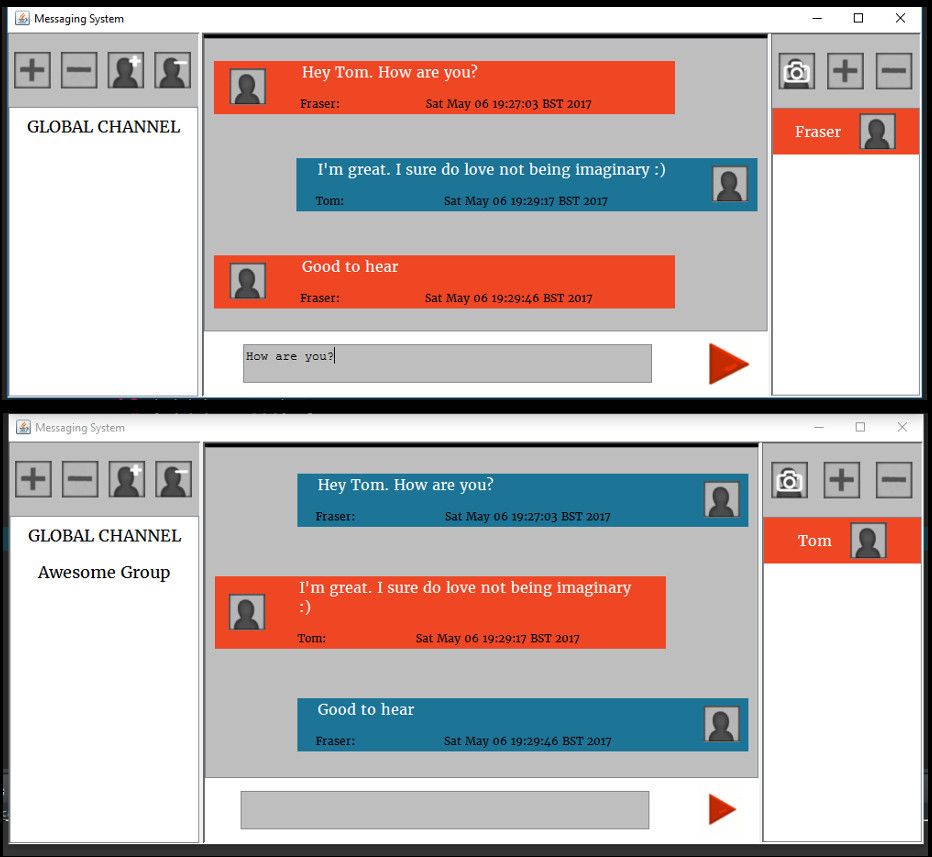
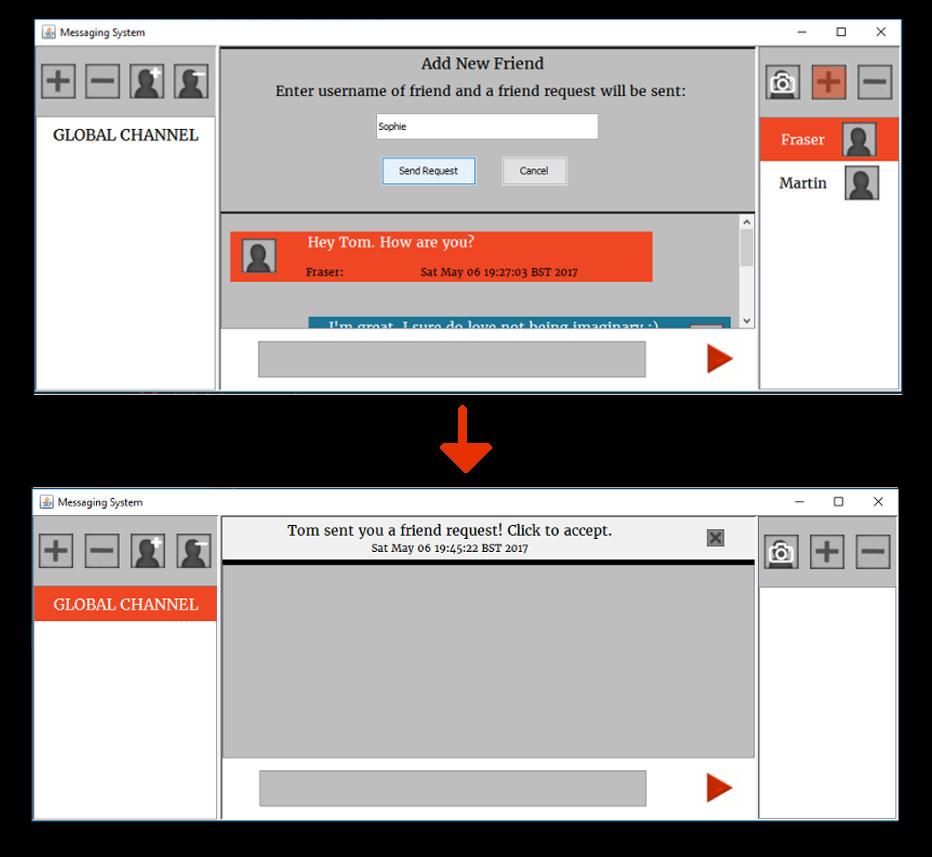
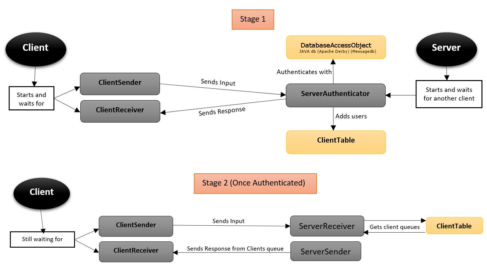

# Simple Message System

  * Based on the client-server architecture with server threads and socket communication.

> **Known Issues Needing to be Fixed:**
> ---Admins can currently remove the group owner which is problematic.
> ---Owners have no way of handing over ownership of a group.
> ---Usernames and Group names are not unique which could lead to some problems.
> ---Users can currently add themself as a friend which is not the intended behaviour.
> ---A user can add anyone they want if they simply send a friend request twice. A 
>    better system for handling friend requests is required on the server side.
> ---Error message popping up in places it shouldn't in the gui.

## Screenshots:

## Solution

[messaging_system/part3](./SOLUTION.md)

## Solution outline
  * We have two threads in the client for sending and receiving input.
  * For each client the server will create a single authentication thread that handles the login/register process. Once a client has logged in the server will create two threads for sending and receiving input.

  * In the server, we use blocking queues to communicate between threads.

  * The **ClientTable** implements two maps for currently online client names and their **MessageQueues** and currently active conversations and their **MessageQueues**.

  * The usernames accounts, groups, and membership status are stored in a database implemented with Java DB (Oracle's supported distribution of the Apache Derby open source database)

  * This is a simplified picture:

 

  * The **ServerReceiver** directs all valid messages to the **ServerInstance** object which handles it appropriately and places any
   necessary messages or **Notification**'s in the appropriate clients **messageQueue**.

## `Default` package:

### ActiveConversation.java
* A class representing an active conversation on the server. 
* Contains a **MessageQueue**, an ArrayList of connected clients, and an ID identifying the conversation. 
* Instances of this class are stored in a hash map in the **ServerInstance** class.

### Client.java
* The main class on the Clients side.
* Kicktarts the **ClientGUI** then ends

### ClientAuthEventHandler.java
`implements ActionListener`
* ActionListener used for the initial log in window

### ClientEventHandler.java
`implements ActionListener`
* ActionListener for the main gui.

### ClientGUI
`extends JFrame`
* The main graphical user interface as outlined in the design.
* Allows the user to read and send messages to groups or friends.
* Allows the user to create and delete new groups.
* Allows the user to add and remove friends.

### ClientReceiver.java
* Loops forever reading **SerializableMessage** objects from the server, 
  reading their type, then passing them on to the appropriate method.

### ClientSender.java
* Loops forever taking messages from a **MessageQueue** of **SerializableMessage**'s
  serializing them and sending them to the Server through the stream.

### ClientTable.java
* A class that implements a **ConcurrentHashMap** containing pairs of usernames and **MessageQueue**'s
* Used by the **ServerInstance** class to place messages in the queue's of online clients and used by
  the **ConversationMananger** to check that everyone in a conversation is offline before storing it in 
  the database.

### Config.java
* Previously **Port.java**
* Contains various configuration information used by both the Client and Sender such as:
    * Port Number
    * Password & Username constraints
    * Database Driver definition and URL
    * A method for combining two usernames into an ID using a uniqueBuffer consisting
     of four exclamation marks. This works on the assumption that clients not be allowed
     exlcamation marks in their user and group names.

### ConnectWorker.java
`implements Runnable`
* A runnable object that attempts to connect to the Server 
* When connected it creates streams, and starts the Sender and Receiver classes
 before notifying the gui to update.

### ConversationManager.java
`extends Thread` 
* Ran on the server to periodically check all **ActiveConversation** objects to make sure that
 at least one of the clients connected to the conversation is still online. If no connected users are 
 online then the conversation is removed from the ActiveConversations hash map and stored in the database

### DatabaseAccessObject
* Class that encapsulates all code pertaining to the access of the derby database.
* Attempts to load driver and database as outlined in the **Config** class when initialized  
* Any problem loading the database or creating the tables on first launch of the Server will
  result in the application ending with an error message.

### MessageQueue.java
* A class that implements a **LinkedBlockingQueue** of **SerializableMessage**'s as a means of grouping 
 conversations together
* Contains three methods: `offer(SerializableMessage m)`, `take()`, and `copyTo(MessageQueue clientQueue)`

### MessageWindow.java
`extends JPanel`
* A JPanel containing a single conversation on the client side. Only one **MessageWindow** is rendered at
  a time in the central pane.
* Each **MessageWindow** object is associated with an **ActiveConversation** object on the Server side via 
 the conversation ID.
* Clicking on one of the friends or groups in the main gui sets the associated **MessageWindow** as the focus
 in the central pane. If no **MessageWindow** exists then one is created and a **StartConversation** object is
 sent to the server.

### PasswordEntry.java
* Class for grouping salt with encrypted password

### PasswordService.java
* Static class that handles all encryption and authorisation 

### Report.java
   * A simple class for reporting normal behaviour and erroneous behaviour.
   * Its methods are all static, and we don't create objects of this class.

### Server.java
* Creates a new **ClientTable**.
* Then attempts to create a new **DatabaseAccessObject**.
* Creates a new **ServerInstance** object passing it the ClientTable and the DatabaseAccessObject.
* Then loops forever listening for clients and starting a new **ServerAuthenticator** for each one.

### ServerAuthenticator.java
* Loops forever waiting for a **SerializableMessage** of type **AuthAttempt** to be received
* If the authorisation attempt is succesful then a **ServerReceiver** and a **ServerSender**
  are started with the client detials and the **ServerAuthenticator** ends.

### ServerInstance.java
* A class that handles all the current happenings on the Server side.
* Keeps track of all friend requests in an ArrayList for **FriendRequest** objects. 
* All interaction with the database happens in this class via the **DatabaseAccessObject**.
* Keeps track of all active conversations via a **ConcurrentHashMap** pairing conversation IDs
  with **ActiveConversation** objects.
    * A conversation's id is the group name if it is a group or the value returned from the
      `Config.getCombinedID(user1, user2)` if it is a private conversation between two friends.

### ServerReceiver.java
* Loops forever accepting **SerializableMessage** objects through the stream and running the 
  appropriate method, handing the message over to the **ServerInstance** if necessary.
* Currently has no provision to end except for in the event of an IOException

### ServerSender.java
* Loops forever sending the **SerializableMessage** objects from the clients **MessageQueue** 
  in the **ClientTable** to the client.

___

## `newtworkObjects` package
The following classes are all designed to represent a command/message sent between the server and client.
Each one containing the necessary data for the message/command along with a `type` String indicating which 
type of **SerializableMessage** it is.

### AddUserToGroup.java
* Client -> Server

### AuthAttempt.java
* Client -> Server

### ClientInfoObject.java
* Server -> Client
* Sent by the server upon logging in
* Contains a list of **Friend** objects representing the clients friends
* Contains a list of **Group** objects representing the clients groups
* Contains a list of **Notification** objects representing the clients 
  notifications since last logging in

### CreateGroup.java
* Client -> Server

### DeleteGroup
* Client -> Server

### Friend.java
* Server -> Client (only inside **ClientInfoObject**/**ServerMessage**)
* Class to represent a friend of a client containing the friends name
  and profile picture if they've set one.

### FriendRequest.java
* Client -> Server

### Group.java
* Server -> Client (only inside **ClientInfoObject**/**ServerMessage**)
* Class to represent a group the client is in containing the group name
  and two boolean values indicating if the client is an admin or the 
  owner of the group.

### Message.java
* Client -> Server
* Server -> Client
* Never sent 'as is'. Always inside other objects in this package
* Contains a String of text representing the message and a **Date** 
  object indicating the time the message was sent.

### NetworkMessage.java
* Client -> Server
* Server -> Client
* A message from one client to another client or group.

### Notification.java
* Server -> Client (sent 'as is' or inside **ClientInfoObject**)
* A notification for a client that appears in the top drop-down 
  part of the gui. A notification can be dismissed with a close 
  button or clicked to be taken to the **MessageWindow** of the
  relevant client.

### RemoveFriend.java
* Client -> Server

### RemoveGroup.java
* Client -> Server

### RemoveUserFromGroup.java
* Client -> Server

### SerializableMessage.java
* The parent class of all objects sent through the socket
* The first parameter of the constructor is for sub classes to define their type
* The second parameter is for specifying the original sender of the message.

### ServerMessage.java
* Client -> Server
* A message sent by the server in the event of an error or a new friend or group
* If the client has a new friend or group then this will contain a **Friend** or 
  **Group** object. The values will be null in the case of an error message.
* A selection of booleans are used by the client to identify the exact nature of
 the message.

### StartConversation.java
* Client -> Server
* Used to tell the server to retrieve a conversation from the database, add it to 
  the list of active conversations, then send the client all the found messages.
* If the conversation is already running then the client is simply added to the 
 **ActiveConversation** objects list of connected users and sent the messages in 
 its **MessageQueue**.

